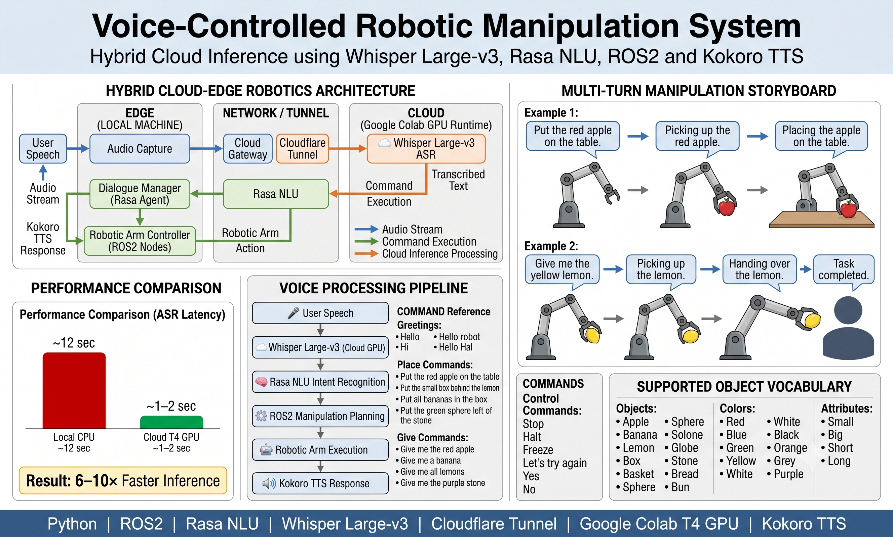

# Virtual Humans & Conversational Agents for Robotics


A deterministic, real-time voice control system designed for physical robotic agents. This project bridges local robotic hardware with cloud-based GPU processing to achieve rapid, conversational AI interactions without hardware bottlenecks.

## 🚀 The Challenge & Solution

### The Problem

Running state-of-the-art Automatic Speech Recognition (ASR) models like Whisper Large-v3 locally on a Mac CPU introduces severe latency (up to 12 seconds). In robotics, this delay makes deterministic, real-time physical control impossible.

### The Engineered Solution

We built a **hybrid cloud-edge architecture**.

By offloading heavy AI transcription tasks to a Google Colab T4 GPU and routing audio data through a secure Cloudflare Tunnel, we bypass local hardware limitations. This setup achieves near real-time inference speeds while local scripts handle conversational logic (Rasa) and localized Text-to-Speech (Kokoro), resulting in seamless robotic voice control.

---

## 🏗️ System Architecture



*Figure 1. Hybrid cloud-edge architecture for a voice-controlled robotic manipulation system integrating Whisper Large-v3, Rasa NLU, ROS2, Cloudflare Tunnel, and Kokoro TTS.*

This project combines cloud-based speech recognition with local robotic manipulation to enable natural language control of a robotic arm. User voice commands are transcribed using Whisper Large-v3 running on a Google Colab T4 GPU, interpreted through a Rasa conversational agent, and executed by ROS2-based robotic control nodes. The system supports object manipulation tasks such as pick-and-place operations, object handovers, and spatial placement commands while providing real-time spoken feedback through Kokoro Text-to-Speech.

### Processing Pipeline

1. **Voice Command Acquisition** – User speech is captured through a local audio interface.
2. **Cloud-Based Speech Recognition** – Audio is securely transmitted through a Cloudflare Tunnel to a cloud-hosted Whisper Large-v3 model for low-latency transcription.
3. **Natural Language Understanding** – The transcribed command is processed by a Rasa NLU pipeline to identify user intent, objects, attributes, and spatial relationships.
4. **Robotic Task Planning** – Parsed commands are translated into structured manipulation actions using custom ROS2 control nodes.
5. **Robotic Arm Execution** – The robotic arm performs pick-and-place, handover, or object positioning tasks based on the interpreted command.
6. **Speech Feedback Generation** – Kokoro TTS generates natural language responses to confirm actions, request clarification, or report task completion.

The hybrid cloud-edge architecture significantly reduces speech recognition latency while maintaining deterministic robotic control, enabling responsive and conversational human-robot interaction.


---

## 📂 Repository Structure

```text
Virtual-Humans-and-Conversational-Agents-Project-
│
├── Core_scripts/
│   ├── robot_main.py
│   ├── cloud_robot.py
│   └── ...
│
├── Rasa_bot/
│   ├── actions/
│   ├── data/
│   ├── domain.yml
│   └── ...
│
├── TTS_engine/
│   ├── download_tts.py
│   ├── fix_download.py
│   └── ...
│
└── Docs/
    └── Voice Robot Command Cheat Sheet
```

### Folder Overview

| Folder         | Purpose                                                            |
| -------------- | ------------------------------------------------------------------ |
| `Core_scripts` | Main execution loops, robot control logic, and cloud communication |
| `Rasa_bot`     | Complete Rasa conversational AI workspace                          |
| `TTS_engine`   | Kokoro Text-to-Speech model setup and management                   |
| `Docs`         | Project documentation and command references                       |

---

## 🛠️ Installation & Setup

### 1. Clone Repository

```bash
git clone https://github.com/zoeb7184/Virtual-Humans-and-Conversational-Agents-Project-.git
cd Virtual-Humans-and-Conversational-Agents-Project-
```

### 2. Create Virtual Environment

```bash
python3 -m venv venv
source venv/bin/activate
```

### 3. Install Dependencies

```bash
pip install -r requirements.txt
```

---

## 🎤 Fetching TTS Models

To keep the repository lightweight, large `.onnx` and `.bin` files are excluded using `.gitignore`.

Download Kokoro TTS models locally:

```bash
cd TTS_engine
python download_tts.py
```

If you encounter path-related issues:

```bash
python fix_download.py
```

---

## ☁️ Cloud GPU Setup (Whisper)

1. Open the Google Colab notebook.
2. Select **Runtime → Change Runtime Type → T4 GPU**.
3. Run all notebook cells.
4. Start the Cloudflare Tunnel.
5. Copy the generated tunnel URL.
6. Update the endpoint configuration inside `Core_scripts`.

---

## 💻 Running the System

The system requires multiple services running simultaneously.

### Terminal 1 – Start Rasa Action Server

```bash
cd Rasa_bot
rasa run actions
```

### Terminal 2 – Start Rasa Core Server

```bash
cd Rasa_bot
rasa run --enable-api
```

### Terminal 3 – Start Robot Controller

```bash
cd Core_scripts
python robot_main.py
```

---

## 🧰 Technology Stack

* Python 3.8+
* Rasa Open Source
* ROS2
* Whisper Large-v3
* Google Colab GPU (T4)
* Cloudflare Tunnel
* Kokoro TTS
* Hybrid Cloud/Edge Architecture

---

## 🎯 Key Features

* Real-time voice command processing
* Cloud-accelerated speech recognition
* Conversational AI using Rasa
* ROS2 robotic control integration
* Local Text-to-Speech feedback
* Secure Cloudflare Tunnel communication
* Modular and scalable architecture

---

## 👨‍💻 Author

### Zoeb Ali Khan

* GitHub: https://github.com/zoeb7184
* LinkedIn: https://linkedin.com/in/zoeb-ali-khan

---

## 📄 License

This project was developed as part of the **Virtual Humans & Conversational Agents** coursework and research in conversational AI for robotics.
